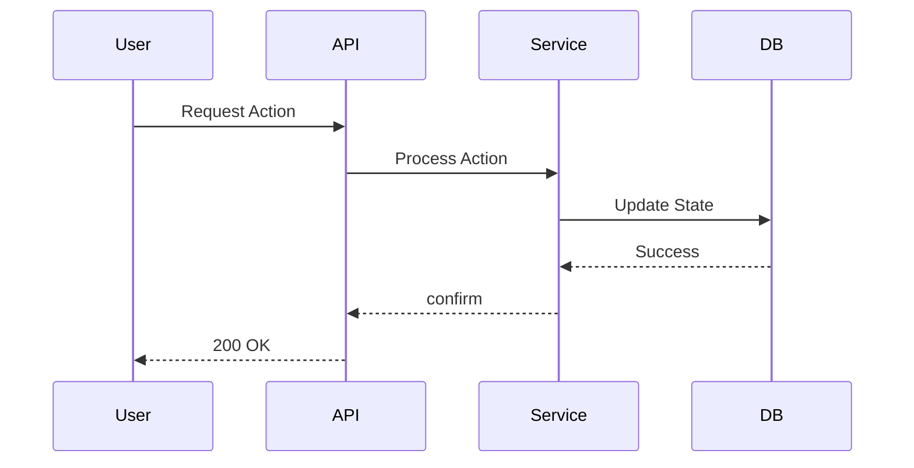

# PR Title

## Summary
<!-- Provide a brief overview of the changes introduced in this PR. What problem does it solve? -->

## Type of Change
<!-- Check the relevant option(s) -->
- [ ] 🚀 New Feature
- [ ] 🐛 Bug Fix
- [ ] 🛠️ Refactor
- [ ] 📚 Documentation
- [ ] ⚙️ Configuration / DevOps

## Key Changes & Files
<!-- Break down the changes by feature or logical unit. List the key files modified to guide reviewers. -->

### 1. [Feature/Fix Name]
- **Description**: <!-- Brief description of what changed here -->
- **Key Files**:
    - `path/to/important_file.go`: <!-- Note on specific change in this file -->
    - `path/to/another_file.go`

### 2. [Feature/Fix Name]
- **Description**:
- **Key Files**:
    - `path/to/file.ts`

## Architecture / Logic Flow
<!-- If this PR changes workflows, state machines, or architecture, verify it with a Mermaid diagram. -->
<!-- Example: Sequence Diagram, State Diagram, Flowchart -->

<!-- Note: Avoid using quotes in Mermaid labels to prevent rendering errors. -->

## Verification
<!-- How did you verify these changes? -->

### Automated Tests
- [ ] `just test-unit` passed
- [ ] `just lint` passed
- [ ] New tests added (if applicable)

### Manual Verification
<!-- Describe the steps to manually verify the changes. -->
1. Step 1...
2. Step 2...

## Checklist
- [ ] My code follows the project's style guidelines
- [ ] I have performed a self-review of my code
- [ ] I have commented my code, particularly in hard-to-understand areas
- [ ] I have made corresponding changes to the documentation
